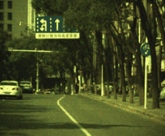
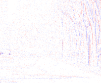
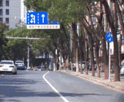
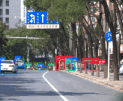
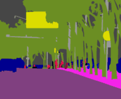
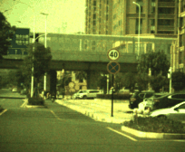
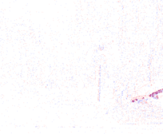
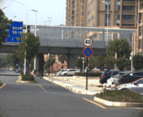
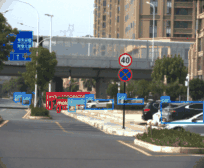
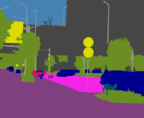

# NEC-Diff: Noise-robust event–RAW complementary diffusion for seeing motion in extreme darkness

Haoyue Liu†, Jinghan Xu†, Luxin Feng, Hanyu Zhou, Haozhi Zhao, Yi Chang*, Luxin Yan

<em>NEC-Diff: Noise-robust event–RAW complementary diffusion for seeing motion in extreme darkness.</em>  
<b>CVPR 2026</b>

---

## 🔥 News

- **[2026.02]** Our paper has been accepted by **CVPR 2026**.
- **[2026.05]** The dataset is being gradually released.

---

## 📌 Introduction

Extreme low-light dynamic imaging is highly challenging due to severe photon noise, motion blur, and texture degradation.  
To address these issues, we propose **NEC-Diff**, a noise-robust event–RAW complementary diffusion framework for motion perception in extreme darkness.

Our dataset contains:

- Pixel-aligned low-light RAW frames
- GT frames
- Event streams
- Detection annotations
- Semantic annotations

---

## 📂 Dataset Release

Our dataset is **gradually being uploaded** to the following Baidu Netdisk link:

📎 **Baidu Netdisk**  
https://pan.baidu.com/s/1ezjF_cz45J1ks8tOXigIAw?pwd=real

🔑 Extraction Code: `real`

We are releasing the dataset incrementally because we plan to continuously add more downstream task annotations and benchmark content, rather than opening the entire dataset at once.

---

## 🎬 Pixel-aligned Event–RAW Visualization

The following visualizations demonstrate the **pixel-level alignment** between low-light RAW frames and event streams, together with downstream perception annotations.

---

### Case 1

| RAW | Events | Overlap | Detection | Semantic |
|---|---|---|---|---|
|  |  |  |  |  |

---

### Case 2

| RAW | Events | Overlap | Detection | Semantic |
|---|---|---|---|---|
|  |  |  |  |  |

---
